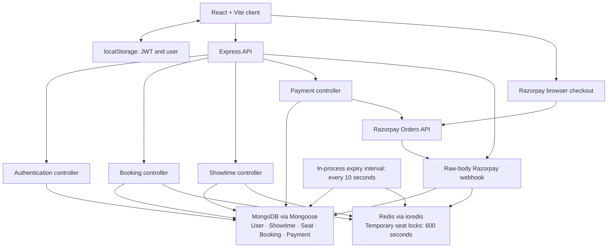

# Seat Lock Engine — Codebase Diagnosis

**Files inspected: 49**, excluding dependency and generated directories.

| Group | Count | Files inspected |
|---|---:|---|
| Backend | 21 | Server bootstrap and app; all five controllers; both middleware files; all ten model/route files; booking expiry worker; seat inventory utility |
| Frontend | 9 | `App.jsx`, `main.jsx`, `AuthPage.jsx`, `BookingPage.jsx`, `SeatMap.jsx`, API configuration module, both stylesheets, and `index.html` |
| Configuration | 16 | All three package manifests and lockfiles; both `.gitignore` files; both local environment files; server environment example; MongoDB, Redis and Razorpay configuration; Vite and ESLint configuration |
| Scripts/Other | 3 | Seat creation script, payment test HTML, client README |

Repository: [seat-lock](</C:/Users/ayush/OneDrive/Desktop/Projects/seat-lock>).

Environment values were inspected without exposing secrets. Lockfiles were parsed for dependency versions, engines, integrity metadata and package sources. Git metadata was checked for tracked dependencies and historical environment files.

**No files were modified during the diagnosis.** The existing change in the rate-limit middleware was preserved. This Markdown file is the subsequently requested export of that report.

## 1. Executive Summary

The project implements a working booking architecture: React calls an Express API, Redis temporarily locks seats, MongoDB stores permanent bookings and inventory, and Razorpay webhooks finalize payments.

Several foundations are correct: authenticated booking ownership, atomic Redis lock acquisition, server-side pricing, raw-body webhook verification, and MongoDB transactions.

**It is not ready for deployment with real payments.** Confirmed problems include:

- A webhook conflict can commit a **partial seat reservation**.
- A concurrent duplicate webhook can change a successful payment to `FAILED`.
- Expired bookings can succeed using a later booking’s locks belonging to the same user.
- Captured payments requiring refunds are recorded as `FAILED`, with no refund workflow.
- Concurrent order requests create multiple payable orders for one booking.
- Anyone can create showtimes without authentication.
- A secret exists in Git history.

The permanent seat update provides meaningful protection against two successful bookings owning the same inventory document. That does **not** make the overall booking/payment lifecycle concurrency-safe.

Validation performed:

| Check | Result |
|---|---|
| Backend JavaScript syntax | Passed for all 25 backend JavaScript files |
| Frontend production compilation | Passed using an in-memory build; no build files written |
| Frontend lint | Failed: two errors |
| Isolated execution of actual controllers with mocked dependencies | Reproduced four failure scenarios |
| In-memory Mongoose validation/query checks | Confirmed schema and input-validation weaknesses |
| Real MongoDB/Redis/Razorpay integration | Not exercised |

The controller checks establish faulty control flow; they are not substitutes for real transaction and concurrency integration tests.

## 2. Architecture



**Frontend.** React uses component-local state and refs. There is no router, global state library or centralized authenticated HTTP client. `App` switches between authentication and booking according to the presence of a stored token.

**Backend.** Express mounts authentication, bookings, showtimes, payments and webhooks. Controllers contain the application logic directly. There is no separate service layer; one is not required merely for style.

**MongoDB.** Five models exist: User, Showtime, Seat, Booking and Payment. There are no Movie or Screen models despite those identifiers appearing on Showtime.

**Redis.** Keys use `seats:<showtimeId>:<seatNumber>`. Values are user IDs, and the TTL is ten minutes. MongoDB seats remain `AVAILABLE` during temporary holds.

**Authentication.** Registration hashes passwords with bcrypt at cost 10. Login issues a one-hour JWT. Protected endpoints verify the JWT and take the user ID from it.

**Inventory.** Showtime creation creates twelve fixed seats, A1–C4, in the same MongoDB transaction as the showtime.

**Payments.** The server creates Razorpay orders. Browser verification checks the checkout signature but does not confirm bookings. Only webhooks perform permanent seat booking.

**Expiry.** A `setInterval` runs inside every backend process. Despite its directory name, this is not a queue-backed worker.

**Synchronization.** Seat status is polled every three seconds. After browser verification, booking status is checked five times with two-second waits.

**Rate limiting.** Three in-memory IP-based limiters protect authentication, seat locking and payment-order creation.

**Errors.** Controllers mostly use individual `try/catch` blocks. There is no application-wide JSON error handler.

**Configuration.** The backend loads dotenv during startup. The frontend uses build-time `VITE_API_URL`. Startup does not validate all required settings or await service readiness.

## 3. Current Booking Lifecycle

The actual stored states are:

| Entity | States |
|---|---|
| Seat | Intended: `AVAILABLE`, `BOOKED`; schema does not enforce this enum |
| Booking | `PENDING`, `EXPIRED`, `FAILED`, `SUCCESS` |
| Payment | `CREATED`, `SUCCESS`, `FAILED`, `REFUNDED` |
| Seat API presentation | `AVAILABLE`, `LOCKED`, `BOOKED` |

`LOCKED` is computed from Redis, not stored on Seat. No current code writes Booking `FAILED` or Payment `REFUNDED`.

### A. Registration and login

1. [AuthPage.handleSubmit](</C:/Users/ayush/OneDrive/Desktop/Projects/seat-lock/client/src/pages/AuthPage.jsx:10>) posts registration or login data.
2. [Authentication routes](</C:/Users/ayush/OneDrive/Desktop/Projects/seat-lock/server/src/modules/auth/auth.routes.js:7>) apply the authentication limiter.
3. [register](</C:/Users/ayush/OneDrive/Desktop/Projects/seat-lock/server/src/controllers/auth.controller.js:7>) checks presence, looks up email, hashes the password and creates User. Registration does **not** issue a token.
4. [login](</C:/Users/ayush/OneDrive/Desktop/Projects/seat-lock/server/src/controllers/auth.controller.js:43>) finds the user, compares the hash and signs a one-hour JWT.
5. [App.handleLogin](</C:/Users/ayush/OneDrive/Desktop/Projects/seat-lock/client/src/App.jsx:14>) stores token and user in localStorage.
6. Protected fetch calls send `Authorization: Bearer …`.
7. [authenticate](</C:/Users/ayush/OneDrive/Desktop/Projects/seat-lock/server/src/middleware/auth.middleware.js:3>) verifies the token and assigns `req.user`.

### B. Normal booking and payment

1. [BookingPage.handleBooking](</C:/Users/ayush/OneDrive/Desktop/Projects/seat-lock/client/src/pages/BookingPage.jsx:178>) submits selected seats.
2. [Booking routes](</C:/Users/ayush/OneDrive/Desktop/Projects/seat-lock/server/src/modules/booking/booking.routes.js:8>) authenticate and rate-limit the request.
3. [lockSeats](</C:/Users/ayush/OneDrive/Desktop/Projects/seat-lock/server/src/controllers/booking.controller.js:8>) checks the showtime, rejects duplicate/nonexistent seats and rejects seats already `BOOKED`.
4. Its Lua script checks all requested Redis keys before setting any locks.
5. MongoDB receives a `PENDING` booking with server-calculated price and expiry.
6. If booking creation fails, an ownership-checked Lua script attempts to release locks.
7. [createPaymentOrder](</C:/Users/ayush/OneDrive/Desktop/Projects/seat-lock/server/src/controllers/payment.controller.js:6>) checks ownership, `PENDING` status and expiry; then reuses or creates an order.
8. The browser opens Razorpay Checkout.
9. [verifyPayment](</C:/Users/ayush/OneDrive/Desktop/Projects/seat-lock/server/src/controllers/payment.controller.js:98>) checks payment ownership and the HMAC signature, then stores payment identifiers.
10. [razorpayWebhook](</C:/Users/ayush/OneDrive/Desktop/Projects/seat-lock/server/src/controllers/payment.webhook.controller.js:9>) validates the raw-body signature and accepts `payment.captured` or `order.paid`.
11. It performs success/idempotency checks and reads Redis lock owners.
12. Its transaction updates available seats, Booking and Payment.
13. After commit, it attempts to release Redis locks.
14. The frontend polls Booking for confirmation.

The browser verification and webhook are independent. **The webhook can arrive first and does not require `/verify` to have run.**

### C. Expired booking

```text
Redis hold reaches TTL
    → Redis key disappears
    → seat API reports AVAILABLE if MongoDB seat is AVAILABLE
    → worker eventually changes PENDING → EXPIRED
```

[checkExpiredBookings](</C:/Users/ayush/OneDrive/Desktop/Projects/seat-lock/server/src/queues/booking.expiry.worker.js:4>) runs every ten seconds. Seat availability does not wait for the worker.

The worker’s MongoDB update correctly requires `PENDING`, but its Redis cleanup identifies ownership only by user.

### D. Late payment

When the lock is absent or belongs to a different user:

```text
Captured payment webhook
    → lock ownership fails
    → Payment FAILED
    → HTTP 200: “marked for refund”
```

No refund is actually queued or issued, and Booking is not updated in this branch.

If the same user has obtained replacement locks, or locks expire after the ownership reads, the expired payment can take a different, unsafe path.

### E. Concurrent users

For identical Redis keys, Lua serializes acquisition: one request wins and the other receives 409.

Permanent finalization additionally requires MongoDB Seat `status: "AVAILABLE"`. With actual transactions and the intended unique index, competing updates cannot both successfully assign the same Seat document to different bookings.

Remaining races affect who is entitled to finalize, partial reservations, payment accounting and temporary availability.

## 4. What Is Implemented Well

Verified strengths:

- Booking and payment endpoints derive identity from a verified JWT.
- Booking status, order creation and payment verification include ownership filters.
- Prices come from the showtime/booking, not a browser-supplied amount.
- Duplicate seat numbers and nonexistent seats are rejected.
- Ordinary multi-seat contention is handled atomically in Lua.
- Unlock scripts compare ownership before deleting.
- MongoDB has a declared unique index on showtime plus seat number.
- Showtime and inventory creation share a transaction.
- Inventory upserts use `$setOnInsert`, so rerunning that utility does not reset existing bookings.
- Webhook routing precedes `express.json()`, preserving the raw body.
- Both checkout and webhook signatures are checked.
- Successful sequential webhook redelivery is short-circuited.
- Redis cleanup failure after a successful MongoDB commit does not undo the booking.
- Frontend interval timers are cleared when their effects are cleaned up.
- Current environment files are ignored and untracked.

These protections are useful, but several are undermined by the failure paths below.

## 5. Critical Issues

### C1. Secret present in Git history

**Classification:** Confirmed exposure in repository history; production blocker.

**Location:** [server environment file](</C:/Users/ayush/OneDrive/Desktop/Projects/seat-lock/server/.env>), including an earlier committed version.

**Secret detected in server/.env (Git history).**

The current file is ignored and untracked, which is appropriate for local configuration. Historical versions remain retrievable after deletion from the current tree. A historical database connection value contains credentials.

**Failure scenario:** Someone with access to repository history retrieves a credential that remains valid.

**Recommended fix:** Rotate the exposed credential, verify database access restrictions, and remove the historical secret from distributed repository history where appropriate. History cleanup does not replace rotation.

Whether the credential has already been rotated or the repository was publicly accessible: **Could not verify from the current codebase.**

### C2. Seat conflict commits a partial booking

**Classification:** Confirmed data-corruption bug.

**File/function:** [razorpayWebhook — seat conflict branch](</C:/Users/ayush/OneDrive/Desktop/Projects/seat-lock/server/src/controllers/payment.webhook.controller.js:145>).

`Seat.updateMany()` updates whichever requested seats remain available. When `modifiedCount` is smaller than the requested seat count, the code marks Payment `FAILED` and **commits the transaction**.

**Failure scenario:** A booking requests A1/A2. A1 becomes booked before this transaction; A2 is still available. The transaction permanently books A2, records a failed payment and leaves Booking pending. The expiry worker never resets MongoDB seats, so A2 remains stranded.

**Evidence:** Isolated execution reproduced `BOOKED/BOOKED`, Booking `PENDING`, Payment `FAILED`, with a commit and no abort.

**Recommended fix:** Abort the complete seat transaction on any count mismatch. Then record the captured payment’s refund-required outcome separately using guarded, idempotent updates.

### C3. Concurrent webhook can downgrade successful payment

**Classification:** Confirmed concurrency bug.

**File/function:** [razorpayWebhook — prechecks and failure updates](</C:/Users/ayush/OneDrive/Desktop/Projects/seat-lock/server/src/controllers/payment.webhook.controller.js:93>).

The payment is read before the transaction. Both failure branches later update by `_id` without protecting terminal state.

**Failure scenario:**

1. Deliveries A and B both read Payment `CREATED`.
2. A commits Booking/Payment `SUCCESS` and releases locks.
3. B reads missing locks.
4. B unconditionally writes Payment `FAILED`.

Booking remains successful while its payment becomes failed. A similar stale request can enter the seat-conflict branch after another request has booked the seats.

**Evidence:** Isolated execution reproduced Booking `SUCCESS` with Payment `FAILED`.

**Recommended fix:** Make every transition conditional on allowed current states; read/recheck authoritative state inside the transaction. A duplicate that encounters an already-completed payment must return the established outcome. Guard failure paths as carefully as success paths.

A unique event-ID record alone would not solve distinct `order.paid` and `payment.captured` events for the same payment.

### C4. Locks identify users, not individual bookings; expiry is not enforced during finalization

**Classification:** Confirmed lifecycle bug and concurrency risk.

**Files/functions:**

- [lockSeats — Redis value](</C:/Users/ayush/OneDrive/Desktop/Projects/seat-lock/server/src/controllers/booking.controller.js:106>)
- [razorpayWebhook — ownership and Booking update](</C:/Users/ayush/OneDrive/Desktop/Projects/seat-lock/server/src/controllers/payment.webhook.controller.js:118>)
- [checkExpiredBookings — unlock](</C:/Users/ayush/OneDrive/Desktop/Projects/seat-lock/server/src/queues/booking.expiry.worker.js:35>)

Webhook finalization never requires Booking `PENDING` or `expiresAt > now`. Redis checks are separate reads performed before the transaction.

**Failure scenarios:**

- Booking B1 expires. The same user locks those seats for B2. B1’s delayed webhook accepts B2’s locks and changes B1 from `EXPIRED` to `SUCCESS`.
- B1’s expiry cleanup deletes B2’s locks because their user IDs match.
- Locks expire after the webhook reads them but before it books the seats.
- The worker expires a booking, then a webhook transaction starting afterward changes it to success.

**Evidence:** An expired booking with same-user replacement locks became `SUCCESS` in isolated execution.

**Recommended fix:** Allocate a booking ID or random reservation token before locking; use it for every check and cleanup. Enforce a conditional, transactional booking transition with an explicit expiry policy. Atomically validate/claim the complete lock set.

Another Redis read does not make Redis and MongoDB atomic. If strict ownership must hold across the finalization boundary, use a durable reservation claim that MongoDB can validate in the seat transaction, retaining Redis for temporary availability.

### C5. Captured money is mislabeled as failed, without refund handling

**Classification:** Confirmed payment-accounting defect; production blocker.

**Files:**

- [Webhook failure handling](</C:/Users/ayush/OneDrive/Desktop/Projects/seat-lock/server/src/controllers/payment.webhook.controller.js:125>)
- [Payment schema](</C:/Users/ayush/OneDrive/Desktop/Projects/seat-lock/server/src/modules/payment/payment.model.js:27>)

The accepted events represent captured/paid payments, but booking rejection produces Payment `FAILED`. Responses claim the payment is marked for refund. There is no refund-required state, refund identifier, refund invocation or reconciliation process.

**Failure scenario:** The customer is charged after expiry, receives no booking and has no durable refund obligation recorded beyond an ambiguous failed status.

**Recommended fix:** Distinguish:

- Payment attempt failed without capture.
- Payment captured and booking confirmed.
- Payment captured but refund required.
- Refund pending/completed/failed.

A simple durable `REFUND_REQUIRED` state with identifiers, reason and an operational reconciliation path is sufficient initially. Do not acknowledge resolution merely because a message says “marked for refund.”

## 6. High Priority Issues

| ID | Classification and location | Problem and failure scenario | Recommended fix |
|---|---|---|---|
| H1 | **Confirmed concurrency bug:** [createPaymentOrder](</C:/Users/ayush/OneDrive/Desktop/Projects/seat-lock/server/src/controllers/payment.controller.js:37>) | The existing-payment lookup and create are separate. Two concurrent requests create two Razorpay orders and two `CREATED` documents. Isolated execution reproduced this. The unique order-ID index does not enforce one order per booking. | Atomically claim order creation per booking, enforce the intended uniqueness in MongoDB, and handle provider-success/database-failure recovery. |
| H2 | **Confirmed authorization defect:** [showtime routes](</C:/Users/ayush/OneDrive/Desktop/Projects/seat-lock/server/src/modules/catalog/showtime.routes.js:8>) | `POST /api/showtimes` is unauthenticated and unthrottled. Anyone can create showtimes and inventory, including invalid prices accepted by the schema. | Restrict creation to authorized administration, or make creation an offline seed operation for this portfolio app. |
| H3 | **Confirmed validation gaps:** [auth controller](</C:/Users/ayush/OneDrive/Desktop/Projects/seat-lock/server/src/controllers/auth.controller.js:9>), [booking controller](</C:/Users/ayush/OneDrive/Desktop/Projects/seat-lock/server/src/controllers/booking.controller.js:15>), [showtime controller](</C:/Users/ayush/OneDrive/Desktop/Projects/seat-lock/server/src/controllers/showtime.controller.js:19>) | Presence checks do not enforce scalar strings, valid IDs, price bounds, date rules or password lengths. An email query object retains MongoDB operators. Past showtimes can be booked. Malformed values commonly become 500 responses. | Validate types and bounds at entry; normalize email and IDs; reject object-valued identifiers/email; validate finite positive prices and showtime eligibility. No passwordless authentication bypass was demonstrated. |
| H4 | **Confirmed recovery gap:** [payment order creation](</C:/Users/ayush/OneDrive/Desktop/Projects/seat-lock/server/src/controllers/payment.controller.js:59>) and [webhook processing](</C:/Users/ayush/OneDrive/Desktop/Projects/seat-lock/server/src/controllers/payment.webhook.controller.js:93>) | Razorpay order creation can succeed before the Payment insert fails. Captured payments also depend entirely on successful webhook processing. There is no durable reconciliation for missing records, prolonged outages or exhausted delivery attempts. | Persist a recoverable order-creation intent; add a bounded reconciliation script/job for unresolved captured payments and refund obligations. |
| H5 | **Confirmed consistency race:** [lockSeats database check and Lua acquisition](</C:/Users/ayush/OneDrive/Desktop/Projects/seat-lock/server/src/controllers/booking.controller.js:42>) | A request can read seats as available, pause while another booking commits and unlocks, then obtain Redis locks for already-booked seats. The user can reach payment for an invalid hold. | Revalidate after lock acquisition and fail safely before charging. Coordinate authoritative reservation/finalization state so delayed finalizers cannot invalidate an accepted hold. |

H1 also exposes a second-charge scenario: the booking succeeds through one order, while a later capture on the second order enters the ambiguous refund path.

## 7. Medium Priority Issues

| ID | Classification and location | Problem / scenario | Recommended fix |
|---|---|---|---|
| M1 | **Confirmed schema defect:** [Seat.status](</C:/Users/ayush/OneDrive/Desktop/Projects/seat-lock/server/src/modules/seat/seat.model.js:16>) | `required: ["AVAILABLE", "BOOKED"]` is not an enum. An invalid status passed Mongoose validation. | Use `enum` and the intended required constraint; validate writes appropriately. |
| M2 | **Confirmed key inconsistency:** [lockSeats key construction](</C:/Users/ayush/OneDrive/Desktop/Projects/seat-lock/server/src/controllers/booking.controller.js:65>) | Redis uses the raw request showtime ID, while webhook/worker keys use MongoDB’s canonical ID. Uppercase hexadecimal IDs can reference the same showtime but different Redis keys. | Validate and canonicalize once, then use the canonical ID everywhere. |
| M3 | **Confirmed frontend race:** [fetchSeats and polling](</C:/Users/ayush/OneDrive/Desktop/Projects/seat-lock/client/src/pages/BookingPage.jsx:33>) | Requests are not aborted or guarded. An old showtime response can overwrite the new showtime’s seats and price; polling requests can overlap and finish out of order. | Abort obsolete requests and reject stale responses; avoid overlapping polls. |
| M4 | **Confirmed checkout state problem:** [handleBooking and showtime selector](</C:/Users/ayush/OneDrive/Desktop/Projects/seat-lock/client/src/pages/BookingPage.jsx:178>) | Showtime/seat controls remain usable while booking is in progress. Lock refs are not scoped by showtime. Dismissal or order failure leaves a hold but no resumable booking state. | Keep an explicit active booking object; scope locks by booking/showtime; prevent conflicting UI actions and allow payment resumption. |
| M5 | **Confirmed authentication UX defect:** [App initialization](</C:/Users/ayush/OneDrive/Desktop/Projects/seat-lock/client/src/App.jsx:8>) | Invalid stored JSON crashes initialization. Expired tokens leave users in the booking screen because 401 responses do not clear authentication. | Parse defensively and centralize 401 handling. |
| M6 | **Confirmed query inefficiency:** [expiry query](</C:/Users/ayush/OneDrive/Desktop/Projects/seat-lock/server/src/queues/booking.expiry.worker.js:8>) | Booking has no index for the repeated `status + expiresAt` query. The worker loads all expired candidates and intervals may overlap. | Add `{status: 1, expiresAt: 1}`, bounded batches and a non-overlapping loop. |
| M7 | **Confirmed operational weakness:** [startup](</C:/Users/ayush/OneDrive/Desktop/Projects/seat-lock/server/server.js:15>) and [Redis configuration](</C:/Users/ayush/OneDrive/Desktop/Projects/seat-lock/server/src/config/redis.js:3>) | Listening/worker startup precede confirmed database readiness. Redis failures are logged, with no explicit readiness or application deadline policy. No graceful shutdown exists. | Await readiness, validate configuration, define bounded failure behavior, stop timers and close connections on shutdown. |
| M8 | **Confirmed leakage/hardening gap:** [payment errors/signature logging](</C:/Users/ayush/OneDrive/Desktop/Projects/seat-lock/server/src/controllers/payment.controller.js:88>) and [webhook signature logging](</C:/Users/ayush/OneDrive/Desktop/Projects/seat-lock/server/src/controllers/payment.webhook.controller.js:39>) | Responses expose raw error messages; logs include expected and received signatures. | Return stable public errors; redact authentication material; compare validated signature buffers using a timing-safe comparison. |
| M9 | **Deployment-dependent risk:** [CORS](</C:/Users/ayush/OneDrive/Desktop/Projects/seat-lock/server/app.js:12>) and [limiters](</C:/Users/ayush/OneDrive/Desktop/Projects/seat-lock/server/src/middleware/rateLimit.middleware.js:3>) | CORS allows every origin. Limits are per-process IP counters; proxy settings are absent. Multiple instances multiply limits; a proxy may collapse users into one IP. | Set intended origins, configure trusted proxy hops for the real deployment, and use shared limiter storage when running multiple instances. |

## 8. Low Priority / Cleanup

| Classification | Location | Finding and recommendation |
|---|---|---|
| Confirmed dormant defect | [Booking.showtimeId](</C:/Users/ayush/OneDrive/Desktop/Projects/seat-lock/server/src/modules/booking/booking.model.js:5>) | `ref: "showtime"` does not match registered model `"Showtime"`. Current code does not populate this field; fix before using population. |
| Confirmed obsolete demo | [payment test HTML](</C:/Users/ayush/OneDrive/Desktop/Projects/seat-lock/server/test-payment.html:74>) | Sends `userId` in the body and no Bearer token, so current `/verify` rejects it. Remove or update the demo. Its public checkout key ID is not a secret key. |
| Confirmed duplicated tooling | [createSeats](</C:/Users/ayush/OneDrive/Desktop/Projects/seat-lock/server/src/scripts/createSeats.js:15>) | Duplicates the seat list, does not validate showtime existence and fails noisily on repeat insertion. Remove if unused or reuse the idempotent inventory utility. |
| Confirmed unused direct dependencies | [root manifest](</C:/Users/ayush/OneDrive/Desktop/Projects/seat-lock/package.json:2>) and [server manifest](</C:/Users/ayush/OneDrive/Desktop/Projects/seat-lock/server/package.json:13>) | Application code uses `ioredis`, not root `redis`; no application file directly imports `mongodb`. Remove unnecessary direct dependencies after checking intended tooling. |
| Confirmed repository hygiene issue | [server dependency directory](</C:/Users/ayush/OneDrive/Desktop/Projects/seat-lock/server/node_modules>) | Git tracks 1,536 dependency files despite the ignore rule. Stop tracking dependencies and install from lockfiles. |
| Confirmed lint failures | [BookingPage](</C:/Users/ayush/OneDrive/Desktop/Projects/seat-lock/client/src/pages/BookingPage.jsx:53>) | Current rules reject synchronous state setting in the effect and an unused catch variable at line 74. Resolve without introducing unnecessary abstractions. |
| Confirmed presentation gap | [App stylesheet](</C:/Users/ayush/OneDrive/Desktop/Projects/seat-lock/client/src/App.css:1>) | Selected/booked class names have no corresponding styling; only locked styling exists. Add clear status presentation and accessible selected-state semantics. |
| Improvement | [README](</C:/Users/ayush/OneDrive/Desktop/Projects/seat-lock/client/README.md>) | Only the Vite template README exists. Document actual setup, states, transaction prerequisites, webhook configuration and failure recovery. |

The fixed twelve-seat layout is reasonable for a portfolio demonstration. Making it configurable is optional.

## 9. Security Audit

**Authentication and authorization**

- Password hashing and JWT verification are present.
- Ownership filters protect the implemented booking/payment reads and actions.
- User-supplied `userId` does not control authenticated booking ownership.
- No confirmed cross-user booking/payment IDOR was found in those protected paths.
- Showtime creation is an unprotected administrative mutation.
- JWT parsing accepts a loose `Bearer` prefix and does not validate the decoded payload shape. Tighten parsing; this is not evidence of a signature bypass.
- Tokens remain valid after browser logout until expiry; there is no revocation mechanism. Whether revocation is needed depends on the intended product.

**Input handling**

- Query operators can enter the email lookup because inputs are not required to be strings.
- Password comparison still runs, so operator acceptance alone does not establish login without a password.
- Password policy/length checks, email-format validation, ID validation and seat element validation are missing.
- Registration’s precheck does not handle duplicate-email races cleanly; the unique index may produce a generic 500.

**Secrets**

**Secret detected in server/.env.**

Its current local, ignored placement is appropriate if access is restricted. Historical exposure is covered by C1.

No current backend secret was found copied into the inspected frontend source. `VITE_API_URL` is public configuration.

**Browser security**

localStorage makes the token accessible to JavaScript running on the origin. That is an XSS impact consideration; no direct XSS sink was established in the inspected React code. Open CORS does not, by itself, bypass JWT authentication or expose another origin’s localStorage.

**Dependency security**

Lockfiles contain registry URLs and integrity metadata. Runtime requirements are modern: backend dependencies require at least Node 20.19 in relevant packages, and frontend tooling has its own version ranges.

Current advisory status and vulnerability-free deployment: **Could not verify from the current codebase.** No clean security-audit result is claimed.

## 10. Concurrency Audit

**Does it prevent double booking?**

For permanent ownership of an individual Seat document, the combination of:

1. Unique `(showtimeId, seatNumber)` inventory,
2. Conditional `AVAILABLE → BOOKED` updates,
3. Real MongoDB transactions,

provides a strong last line of defense.

That conclusion assumes the unique index actually exists and the deployment supports transactions. MongoDB documents conditional single-document atomicity and the need for transactions across multiple documents. [MongoDB atomicity documentation](https://www.mongodb.com/docs/manual/core/write-operations-atomicity/)

The code does not verify the deployed indexes/topology. It also demonstrably permits inconsistent partial bookings and payment states.

| Edge case | Assessment | Why |
|---|---|---|
| Two users lock A1 simultaneously using canonical IDs | **SAFE for acquisition** | Lua checks and sets execute without another request interleaving. |
| A1/A2 request while one key already exists | **SAFE for ordinary contention** | Script checks all keys before writing any. |
| Redis errors during execution or client loses the reply | **PARTIALLY SAFE** | Outcome may be uncertain; TTL bounds stale holds. Lua atomic execution is not a general rollback guarantee for every runtime failure. |
| Duplicate seat numbers | **SAFE** | Explicitly rejected before locking. |
| Invalid/nonexistent showtime | **PARTIALLY SAFE** | Missing valid IDs return 404; malformed IDs generally become 500. |
| MongoDB booking insert fails after lock | **PARTIALLY SAFE** | Compensating unlock exists, but can fail or race with same-user replacement locks. |
| Locks expire before webhook ownership reads | **PARTIALLY SAFE** | Different/missing owner rejects booking, but refund accounting is unsafe. |
| Locks expire after webhook ownership reads | **UNSAFE** | No atomic finalization claim or expiry condition protects the following transaction. |
| Same user rebooks expired seats | **UNSAFE** | Old webhook/worker accepts or deletes the newer booking’s locks. |
| Worker and webhook run together | **UNSAFE overall** | Worker guards `PENDING`; webhook does not. Some interleavings conflict safely, others resurrect expired bookings. |
| Sequential duplicate successful event | **SAFE for database re-finalization** | Success checks return early. |
| Concurrent duplicate events | **UNSAFE** | Stale failure branches can overwrite committed success. |
| `order.paid` followed by `payment.captured` | **PARTIALLY SAFE** | Sequential handling works; overlapping handling inherits duplicate races. |
| Two users pay for the same seat | **PARTIALLY SAFE** | Permanent conditional writes prevent two owners under stated assumptions; losing payment/refund handling is defective. |
| One seat conflicts in a multi-seat booking | **UNSAFE** | Available subset is committed instead of rolled back. |
| MongoDB transaction fails | **PARTIALLY SAFE** | Normal errors abort and return 500, but retries may occur after locks expire. |
| Redis fails after successful MongoDB commit | **SAFE for permanent booking** | Success is retained; MongoDB `BOOKED` takes precedence and locks eventually expire. |
| Redis loses locks before finalization | **UNSAFE for service completion** | Valid captured payments can lose their reservation and lack proper recovery/refund tracking. |
| Backend restarts while locks remain | **PARTIALLY SAFE** | External state survives if services retain it; browser booking recovery is absent and worker restarts later. |
| Multiple backend instances | **PARTIALLY SAFE** | Shared stores coordinate writes; duplicate workers, local limiters and webhook races remain. |

Redis documents script atomic execution, but scripts spanning different cluster hash slots require additional key design. [Redis Lua documentation](https://redis.io/docs/latest/develop/programmability/lua-api/)

## 11. Payment Audit

**Amounts.** The server calculates rupees from database prices and converts to paise with rounding. The normal example of ₹250 becoming 25,000 paise is correct. However, schemas do not constrain amounts to positive finite values or defined precision. Integer paise would simplify monetary invariants.

**Ownership.** Order creation checks the booking’s user. Verification checks the payment’s user. These are correct.

**Verification.** `/verify` confirms the checkout signature and records identifiers. It does not establish capture or booking success, which is appropriate as long as the UI explains the pending state.

**Webhook validation.** Raw-body HMAC validation is correctly positioned. Razorpay requires signatures to be computed over the raw body. [Razorpay validation documentation](https://razorpay.com/docs/webhooks/validate-test/)

**Event validation.** The handler trusts event type and matching order ID without checking captured amount, currency, payment status or consistency between order/payment entities. Authentic signatures reduce the threat, but explicit checks would protect accounting against unexpected payload/configuration cases.

**Idempotency.** One indexed event-ID field is stored on Payment. It is not unique, does not retain all events and is only checked with `status: "SUCCESS"`. Sequential success checks help; they do not make concurrent handling safe.

**Delivery order and retries.** Razorpay documents duplicate delivery, non-guaranteed ordering and retries after non-2xx responses. Therefore, the reproduced overlap is a required operating case, not just an artificial test. [Razorpay webhook best practices](https://razorpay.com/docs/webhooks/best-practices/)

**Browser closure.** Closing the browser after paying does not inherently stop backend confirmation because the webhook is independent. The frontend cannot recover the booking after reopening because it does not persist or list active bookings.

**Failure versus refund.** Current handling fails this distinction. Genuine `payment.failed` events are ignored server-side, while captured payments rejected by booking logic become `FAILED`. `REFUNDED` exists only as an unused enum value.

**Transaction retry handling.** Manual transaction management lacks structured transient-transaction/unknown-commit retry handling. A retry that discovers committed success can return safely, but a delayed uncommitted retry can lose the hold. Treat commit ambiguity differently from a definite booking rejection.

## 12. Frontend Audit

Additional findings beyond M3–M5:

- `lockedSeatsRef` stores seat numbers without showtime or booking identity.
- The selection filter retains a seat whenever the ref contains its number, even if the latest server status is booked or the seat is absent.
- Booking status polling stops after roughly ten seconds and leaves no continuing confirmation or recovery mechanism.
- A payment verification error prevents subsequent booking polling even though the webhook may already have succeeded.
- The five polling attempts and payment callbacks are not canceled on logout/unmount.
- Unmount clears interval timers, but does not close the Razorpay instance or abort network requests.
- The DOM fallback targeting Razorpay’s internal close-button classes is fragile.
- Timer expiry is based on the browser clock and floors remaining seconds. It is a UX indicator, not a security boundary.
- A slow order request can finish after the local timer clears and still open Checkout; no fresh active-booking check precedes opening.
- Authentication submission has no busy flag, allowing duplicate requests.
- Catalog/seat errors primarily go to the console, leaving unclear empty or stale UI.
- Render-time logging prints seats and selection on every render, including timer-driven renders.

For twelve seats, rerender cost and the selected-seat array filtering are not significant enough to justify complex memoization. Correct request cancellation and a small explicit active-booking state solve more important problems.

## 13. Database & Redis Audit

### Mongoose schemas

| Model | Verified structure | Issues |
|---|---|---|
| User | Required name/email/password; normalized email; unique email; timestamps | No format/length/password policy; duplicate-key race handling missing |
| Showtime | ObjectId movie/screen; date; numeric price; timestamps | No Movie/Screen models or existence checks; no price/date bounds |
| Seat | Showtime reference; seat number; booking reference; timestamps; compound unique index | Broken status enum; deployed index existence unverified |
| Booking | Showtime reference; string user ID; seats; numeric total; status; expiry; timestamps | Incorrect reference name; no expiry query index; schema permits empty seat arrays; no total bounds |
| Payment | Booking reference/index; string user ID; numeric amount; currency; statuses; unique order ID; event index; timestamps | No booking-level order uniqueness; no refund obligation fields; unconstrained amounts/currency; payment ID not unique |

String user IDs are internally consistent in the current code; they are not, by themselves, a correctness bug. ObjectId references would improve schema consistency if that is desired.

### Indexes justified by current queries

- **Add Booking `{status: 1, expiresAt: 1}`** for expiry scanning.
- **Enforce the intended Payment uniqueness per booking/order-creation lifecycle** after deciding whether multiple attempts are supported.
- Consider Showtime `{startTime: 1}` if its sorted collection grows.
- Existing Seat compound indexing supports showtime/seat lookups.
- Existing Payment order-ID indexing supports webhook lookup.
- Existing Payment booking indexing already helps the active-order lookup; an additional compound performance index is not the first priority.
- No extra Booking `_id + userId` index is needed merely for the current point lookup: `_id` is already selective.

Do not use a Booking TTL index to delete expired records; payment reconciliation needs historical bookings.

### Redis and performance

- Redis is correctly intended as temporary state, with MongoDB permanent.
- Ownership must change from user ID to reservation identity.
- Booking expiry is calculated after Redis acquisition, so the MongoDB deadline can be later than the real hold expiry.
- Each seat poll makes two MongoDB queries and twelve individual Redis GET commands for the current inventory. `Promise.all` overlaps those commands; it does not turn them into one command.
- `MGET` or pipelining is a simple improvement if polling load matters.
- Three-second polling is reasonable for a small demo. There is no evidence here requiring WebSockets.
- Worker scans and unbounded showtime listing matter more as historical data accumulates.
- Current Redis keys are not designed for multi-key Redis Cluster hash-slot requirements. That is a future deployment constraint, not a reason to introduce a cluster now.
- No explicit Redis command deadlines, persistence expectations or outage policy are documented.

## 14. API Inventory

All paths below include the prefixes mounted in [app.js](</C:/Users/ayush/OneDrive/Desktop/Projects/seat-lock/server/app.js:15>).

| Method | Path | Authentication | Rate limit | Input | Successful output / purpose | Main issue |
|---|---|---|---|---|---|---|
| POST | `/api/auth/register` | None | 10 / 15 min, shared auth limiter | name, email, password | 201 message, userId | Weak type validation; duplicate-email race |
| POST | `/api/auth/login` | None | Same auth limiter | email, password | 200 token and user | Object-valued email accepted into query |
| POST | `/api/bookings/lock` | JWT | 10 / minute | showtimeId, seats | 201 bookingId, seats, totalAmount, expiresAt | User-scoped locks; stale inventory check |
| GET | `/api/bookings/:bookingId/status` | JWT + owner | None | bookingId path parameter | 200 bookingId, status, seats | Malformed IDs become 500; no payment/refund outcome |
| POST | `/api/showtimes` | None | None | movieId, screenId, startTime, ticketPrice | 201 showtimeId | Public administrative write |
| GET | `/api/showtimes` | None | None | None | 200 full showtime array | Unbounded; includes past shows |
| GET | `/api/showtimes/:showtimeId/seats` | None | None | showtimeId | 200 showtime metadata and computed seat statuses | Redis fan-out; malformed IDs; no ownership distinction |
| POST | `/api/payments/create-order` | JWT + booking owner | 10 / minute | bookingId | 200 reused / 201 new payment and order details, amount in paise, public key ID | Concurrent duplicate orders; external-order recovery gap |
| POST | `/api/payments/verify` | JWT + payment owner | None | order ID, payment ID, signature | 200 paymentId, bookingId | Raw errors and signature logging; no explicit terminal-state consistency check |
| POST | `/api/webhooks/razorpay` | HMAC signature; no JWT | None | Raw JSON plus signature/event headers | 200 ignored, duplicate, confirmed or booking-rejected outcome | Partial commits, state regression, expiry and refund defects |

There are no cancellation, booking-history, refund-status, payment-reconciliation or health/readiness endpoints.

The webhook should remain independent of user JWTs. Any abuse controls must account for legitimate provider retries.

## 15. Dead / Obsolete Code

Safe cleanup candidates after checking intended usage:

- Root `redis` dependency: no application import; backend uses `ioredis`.
- Direct server `mongodb` dependency: no application import; Mongoose manages the driver.
- Unused Express import in [server bootstrap](</C:/Users/ayush/OneDrive/Desktop/Projects/seat-lock/server/server.js:1>).
- Unused `conn` variable in [connectDB](</C:/Users/ayush/OneDrive/Desktop/Projects/seat-lock/server/src/config/db.js:5>).
- Commented duplicate key construction in the webhook.
- Render debugging logs in BookingPage and SeatMap.
- Obsolete payment test page, unless updated to the authenticated flow.
- Duplicate seat seeding script, if the inventory utility replaces its intended use.

The Redis import in `server.js` has connection side effects; do not remove it solely because its variable is unused without preserving intended initialization.

Booking `FAILED` and Payment `REFUNDED` are currently unwritten states. Decide their lifecycle meaning rather than deleting them reflexively.

The hardcoded DNS override is not needed by the domain model. Remove it unless a documented deployment requirement justifies it.

## 16. Production Checklist

| Status | Requirement |
|---|---|
| **[BLOCKER]** | Rotate the secret exposed in Git history and verify access controls |
| **[BLOCKER]** | Abort partial seat conflicts |
| **[BLOCKER]** | Prevent terminal payment-state regression |
| **[BLOCKER]** | Use booking-specific lock ownership and enforce expiry/finalization rules |
| **[BLOCKER]** | Persist and operationally resolve captured-but-unfulfilled payments |
| **[BLOCKER]** | Prevent duplicate payable orders per intended booking lifecycle |
| **[BLOCKER]** | Protect showtime creation |
| **[BLOCKER]** | Verify transaction-capable MongoDB and required deployed indexes |
| **[BLOCKER]** | Run real booking/payment concurrency integration tests |
| **[PASS]** | Raw-body webhook routing and HMAC verification exist |
| **[PASS]** | Implemented booking/payment endpoints enforce user ownership |
| **[PASS]** | Current `.env` files are ignored; server `.env.example` exists |
| **[PASS]** | Backend start script and frontend production build exist |
| **[NEEDS WORK]** | Production API URL: current client configuration points to HTTP loopback |
| **[NEEDS WORK]** | Client environment example and complete deployment documentation |
| **[NEEDS WORK]** | Required-variable validation, readiness and graceful shutdown |
| **[NEEDS WORK]** | CORS policy, proxy configuration and shared rate limits if scaled |
| **[NEEDS WORK]** | Consistent public errors and redacted structured logs |
| **[NEEDS WORK]** | Recovery UI for pending payments and expired authentication |
| **[NEEDS WORK]** | Remove tracked dependencies |
| **[NEEDS WORK]** | Frontend lint fixes and automated checks |
| **[NEEDS WORK]** | Verify HTTPS termination, Redis transport/access controls and database backups |
| **[NEEDS WORK]** | Verify Razorpay capture settings, webhook subscriptions, alerting and reconciliation |

Actual deployed HTTPS, MongoDB topology/indexes, Redis durability and Razorpay Dashboard settings: **Could not verify from the current codebase.**

MongoDB standalone deployments do not support the transactions this implementation relies on. [MongoDB production considerations](https://www.mongodb.com/docs/manual/core/transactions-production-consideration/)

## 17. Test Matrix

There are currently no application automated test suites. The server `test` script deliberately exits with “no test specified”; the HTML payment demo is not an integration suite.

Prioritize tests against a real disposable Redis instance and transaction-capable MongoDB, with Razorpay mocked at the HTTP boundary. Separately validate the provider integration in Razorpay test mode.

| Priority | Test | Required assertion |
|---|---|---|
| Blocker | Two users lock identical seat concurrently | Exactly one succeeds |
| Blocker | Overlapping multi-seat requests | No partial lock set on ordinary contention |
| Blocker | Partial inventory conflict at finalization | Entire seat update rolls back |
| Blocker | Concurrent duplicate captured events | One stable outcome; no success-to-failure transition |
| Blocker | Concurrent `order.paid` and `payment.captured` | Same stable outcome regardless of ordering |
| Blocker | Same-user relock after expiry | Old webhook cannot consume new locks |
| Blocker | Old worker cleanup after relock | New booking’s locks remain intact |
| Blocker | Lock expires before/during finalization | Explicit expiry policy enforced without stealing another reservation |
| Blocker | Worker/webhook race | Expired booking cannot be improperly resurrected |
| Blocker | Late captured payment | No seat booking; durable refund-required obligation |
| Blocker | Concurrent create-order requests | One intended active provider order |
| Blocker | Two orders already exist and both capture | Extra capture is accounted for and reconciled |
| Blocker | Mongo failure after Redis acquisition | No durable booking; bounded/cleaned temporary locks |
| Blocker | Mongo failure during seat transaction | No partial permanent writes |
| Blocker | Commit succeeds but acknowledgement is lost | Retry detects established outcome |
| Blocker | Redis cleanup failure after commit | Booking/payment remain successful |
| Blocker | Redis outage before finalization | No fabricated success; recoverable captured-payment state |
| Blocker | Unauthorized showtime creation | Rejected |
| High | Registration/login | Hash stored; password never returned; valid JWT issued |
| High | Expired/tampered JWT | Rejected; frontend returns to authentication |
| High | Cross-user booking/status/order/verify | No access or mutation |
| High | Invalid webhook and checkout signatures | No payment/booking/seat mutation |
| High | Webhook before `/verify` and reverse | Correct outcome in both orders |
| High | Browser closes after capture | Backend completes; user can later retrieve outcome |
| High | Provider order created, Payment insert fails | Recovery identifies and resolves orphan order |
| High | Wrong amount/currency/entity relation | Rejected into an accountable exception flow |
| High | Duplicate email registration race | Deterministic conflict, not generic 500 |
| High | Object-valued email/IDs, malformed IDs | 400; no operator injection |
| High | Uppercase ObjectId representation | Same Redis identity as canonical ID |
| High | Negative/zero/non-finite prices; invalid/past dates | Rejected according to explicit policy |
| High | Duplicate/non-string/unknown seats | Rejected before mutation |
| High | Multi-instance and proxy rate limits | Intended limits and client identity preserved |
| Medium | Seat poll responses return out of order | Active showtime/state remains correct |
| Medium | Dismiss checkout/order failure | Existing booking can be resumed or clearly abandoned |
| Medium | Unmount/logout during requests | No lingering checkout or obsolete updates |
| Medium | Corrupt localStorage | App starts safely |
| Medium | Webhook delayed beyond frontend polling window | Recoverable pending UI; no false final result |
| Medium | Restart with existing locks/bookings | Expiry and reconciliation resume |
| Medium | Lint and production build | Both pass |

## 18. Recommended Fix Order

1. **BLOCKER — Contain historical secret exposure.** Rotate the credential and verify access before relying on repository cleanup.
2. **CRITICAL — Define enforceable states.** Establish reservation identity, terminal booking/payment transitions and refund-required outcomes.
3. **CRITICAL — Repair webhook transactions.** Abort partial conflicts, guard all transitions, handle duplicate/concurrent events and enforce expiry.
4. **CRITICAL — Repair lock ownership and worker cleanup.** Apply the same booking token and canonical key format everywhere.
5. **HIGH — Serialize order creation and add recovery.** Cover provider/database split failures and extra captures.
6. **HIGH — Protect and validate API mutations.** Restrict showtime creation; validate types, IDs, seats, prices and dates.
7. **HIGH — Add critical integration tests.** Establish the concurrency and payment invariants before real-money deployment.
8. **MEDIUM — Add query indexes and operational controls.** Readiness, bounded workers, error handling, shutdown, proxy/CORS configuration and reconciliation.
9. **MEDIUM — Repair frontend recovery and synchronization.** Active-booking state, request cancellation, resumable payment and authentication handling.
10. **LOW — Clean the repository and documentation.** Remove tracked dependencies and obsolete code, resolve lint errors and document deployment.

The existing React–Express–MongoDB–Redis architecture can be retained. The required work is to make reservation ownership, payment accounting and state transitions reliable within that architecture.
